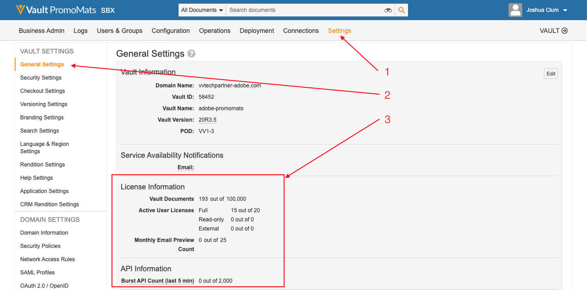

# ベストプラクティス、ガードレール、および通知

## バージョン

この統合には、次の最小ソフトウェア バージョンが必要です。

* Adobe Experience Manager、6.5.5以降
* Veeva Vault PromoMats、20R3.2以降

## データのプライバシー

この統合は、Adobe Experience ManagerとVeeva Vault PromoMats間でコンテンツを転送するように設計されています。 データ管理者は、データの収集と使用に適用されるプライバシーに関する法律や規制を遵守する責任があります。

## コンテンツ同期頻度

統合ワークフローがトリガーされると、AEMのコンテンツとメタデータがAEMからVVPNに同期されます。 これは自動または手動で行うことができます。 VVPM メタデータは、VVPMからAEMに同期されます。 これはスケジューラーで自動的に実行することも、ボタンをクリックして手動で実行することもできます。

## 統合の制限事項とベストプラクティスおよびガードレール

この統合を使用する場合は、次の制限事項を考慮してください。

* メタデータの同期時にサポートされるデータタイプは、「テキスト」と「マルチラインテキスト」のみです。
* 統合では、AEM モジュラーコンテンツ（コンテンツフラグメントおよびエクスペリエンスフラグメント）はサポートされていますが、VVPM モジュラーコンテンツはサポートされていません。
* VVPM リンクされたドキュメントはサポートされていません。
* VVPMからAEMへのVVPM ビジュアルアノテーションの同期はサポートされていません。
* 統合では、VVPMからAEMにコンテンツが読み込まれません。
* メタデータの検証はサポートされていません。
* ドキュメントの数は、Veeva ライセンスに基づいて制限されます。 [&#x200B; ライセンス制限](#veeva-license-limitations)を参照してください。
* API呼び出しの数は、Veeva ライセンスに基づいて制限されます。 詳しくは、[APIの制限](https://developer.veevavault.com/docs/#what-are-rate-limits)を参照してください。 [&#x200B; ライセンス制限](#veeva-license-limitations)を参照してください。

## Veeva ライセンスの制限

VVPMの一般設定に移動して、インスタンスの制限を監視できます。

