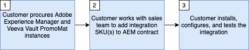

# Veeva Vault PromoMatsとAdobe Experience Managerの統合の基本を学ぶ

この統合により、コンテンツを管理し、権限とコンプライアンスを適用しながら、業界トップクラスのエクスペリエンスの提供を活用できます。

この統合には、次の最小ソフトウェア バージョンが必要です。

* Adobe Experience Manager、6.5.5以降
* Veeva Vault PromoMats、20R3.2以降

>[!NOTE]
>
>統合には、両方のシステムでサービスユーザーと適切な権限が必要です。
>

>[!IMPORTANT]
>
>この機能は、製品の一部として標準搭載されていません。 導入にはAdobe Consultingの保守契約が必要です。 詳細については、Adobeの担当者にお問い合わせください。
>

## 原則と機能

この統合は、次の2つの主要なユースケースをサポートするように設計されています。

1. コンテンツの承認 – 新しいコンテンツが作成された場合、または既存のコンテンツがAEMで編集された場合、コンテンツは、ライフサイエンスのMedical, Legal, Regulatory （MLR）承認プロセスをサポートするVVPMでの使用を承認する必要があります。
1. コンテンツ管理 – AEMで作成された文書に対して、AEMで作成されたデジタル戦術（電子メール、プレゼンテーション、web サイトなど）とその要素（ロゴ、写真、グラフィックなど）の間のプロモーションマットの関係を確立することで、アセットの使用状況を可視化します。

主な利点は次のとおりです。

* デジタルリポジトリ全体で、アセットとコンテンツの信頼できる唯一の情報源を維持。
* Veeva Vaultを活用した著作権とコンプライアンスの管理、AEMを活用したクラス最高のアセットおよびコンテンツ制作/配信。
* AEMとVeeva Vault間でコンテンツとメタデータを自動的に移動できます。
* 承認ワークフローのためにVeevaにコンテンツを送信する手作業を削減します。
* 各システムはその強みに対して使用され、コネクタはシステム間でコンテンツを自動的に移動するのを支援し、市場投入までの時間を短縮します。

統合の仕組み？

* AEM サイトページ、Assets、コンテンツフラグメントおよびエクスペリエンスフラグメントのVVPMへの送信をサポートしています。 AEMのページ、コンテンツフラグメント、エクスペリエンスフラグメントは、スクリーンショット PDFまたは画像として送信できます。 AEM Assets バイナリはそのまま送信されます。
* AEMからVVPMに設定可能な一部のメタデータ要素の手動および自動同期をサポートします。
* VVPMからAEMに設定可能な一部のメタデータ要素の手動および自動同期をサポートします。
* VVPMでAEM サイトページ、Assets、コンテンツフラグメント、エクスペリエンスフラグメントの関係をサポートし、コンテンツの関係を自動化します。
* 複数のデバイスタイプに対するレンディション生成をサポートしています。

>[!NOTE]
>
>設定オプションについて詳しくは、統合使用ドキュメントを参照してください。
>

コネクタは何をしません。

* Veevaまたはその逆のAEM プロセスおよび機能をレプリケートしません。
* MLRは単独では行いません。 これにより、コンテンツをVeevaに送信し、MLRが行われる場所に自動的に送信できます。
* AEMとVeevaの間で同一の設定を作成するために使用されるわけではありません。 あらゆるコンテンツが2つのプラットフォームの間を移動する必要はありません。

>[!IMPORTANT]
>
>この統合により、現在AEMはコンテンツの同期に関する信頼できる唯一の情報源とみなされています。

## 統合の取得

この統合をプロビジョニングするには、次の手順に従う必要があります。

以下のフローチャートとフローチャートの詳細に従って、統合をリクエストおよび設定してください。

フローチャートの詳細（上記の手順にマップ）:

* **手順1** - Veeva Vault PromoMatsおよびAdobe Experience Managerのライセンスを既にお持ちか、現在購入中であると見なされます。
* **手順2** – 統合を利用するには、Adobe Consultingとのメンテナンス契約の概要を示す新しい販売注文（SO）に署名する必要があります。
* **手順3** – 統合パッケージをインストール、アクティブ化、設定します。

## サポート

次に、サポートチームに問い合わせて問題を記録する方法を説明します。

### 統合またはAdobe Experience Manager サポートのリクエスト

サポートチケットは、Adobe カスタマーケアで記録できます。 Adobe Experience Cloud管理者は、[Adobe Admin Console](https://adminconsole.adobe.com/)にログオンし、「サポート」タブをクリックして、ケースを作成する必要があります。 統合に関する問題がある場合は、次の情報を必ず含めてください。

* **プロセスタイトル**: `AEM - Veeva Vault Integration`
* **プロセス所有者**: `Data Engineering`
* **説明**: `Description of the issue`
* **連絡先**: `The email address(es) for relavant AEM point of contacts for your organization.`
* **AEM インスタンス URL**: `Place the Adobe Experience Manager instance url here.`
* **Veeva インスタンス URL**: `Place the Veeva Vault PromoMats instance url here.`

### Veeva Vaultのプロモーションマットサポートのリクエスト

場合によっては、Veeva Vault PromoMats インスタンスの操作に問題が発生することがあります。 そのような場合は、Veeva Vault PromoMatsの管理者が[Veeva Support](http://support.veeva.com/)でサポートチケットを作成するように指示される場合があります。 Veeva インスタンスのステータスは、[Veeva Trust](http://trust.veeva.com/)に移動して表示できます。
