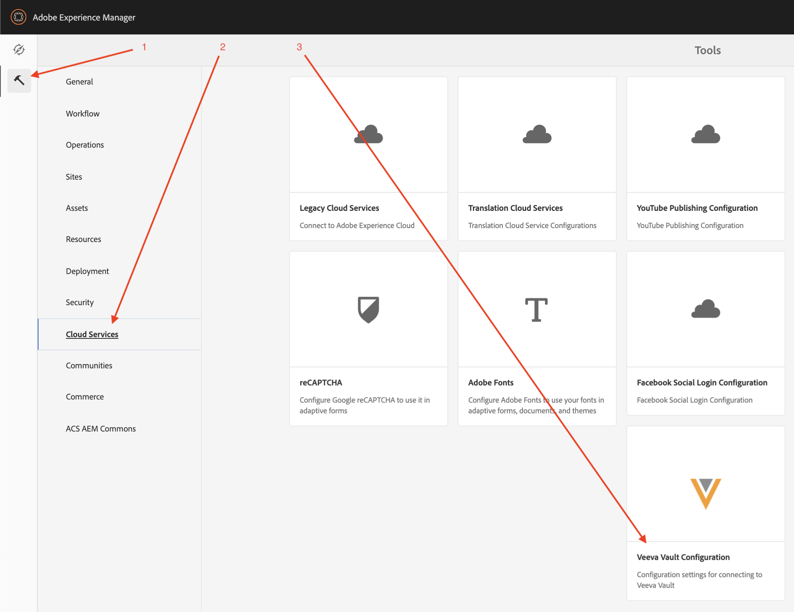
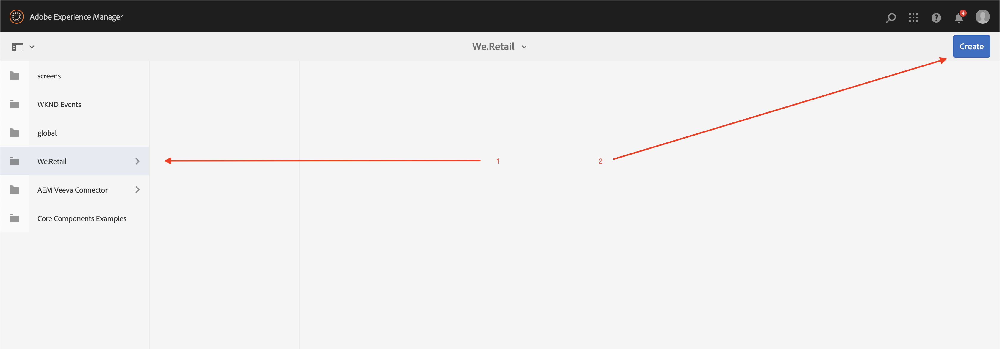
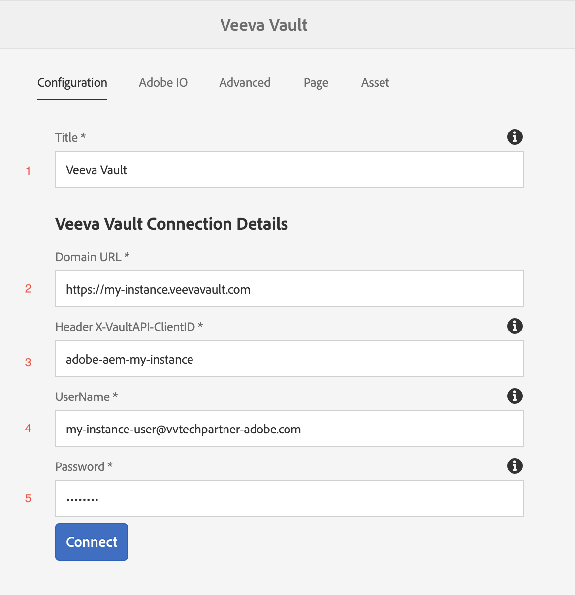
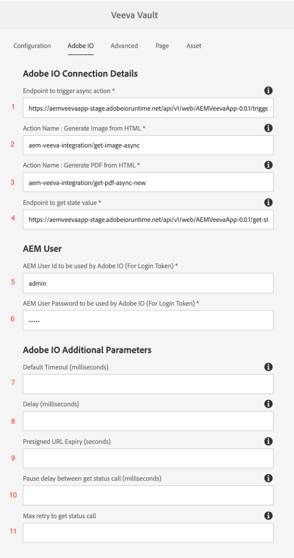
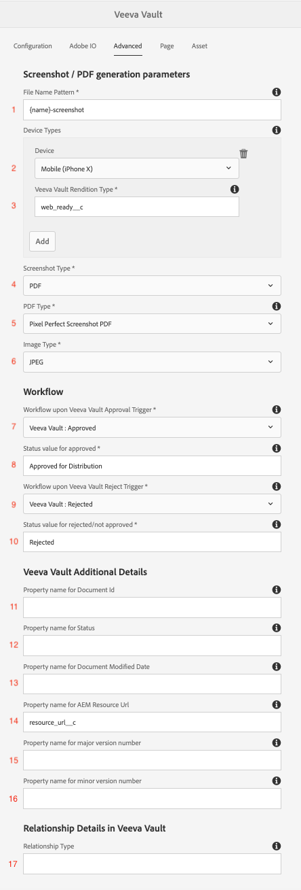
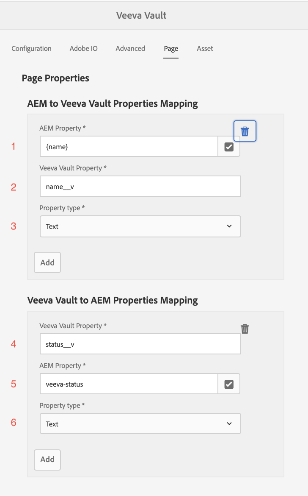
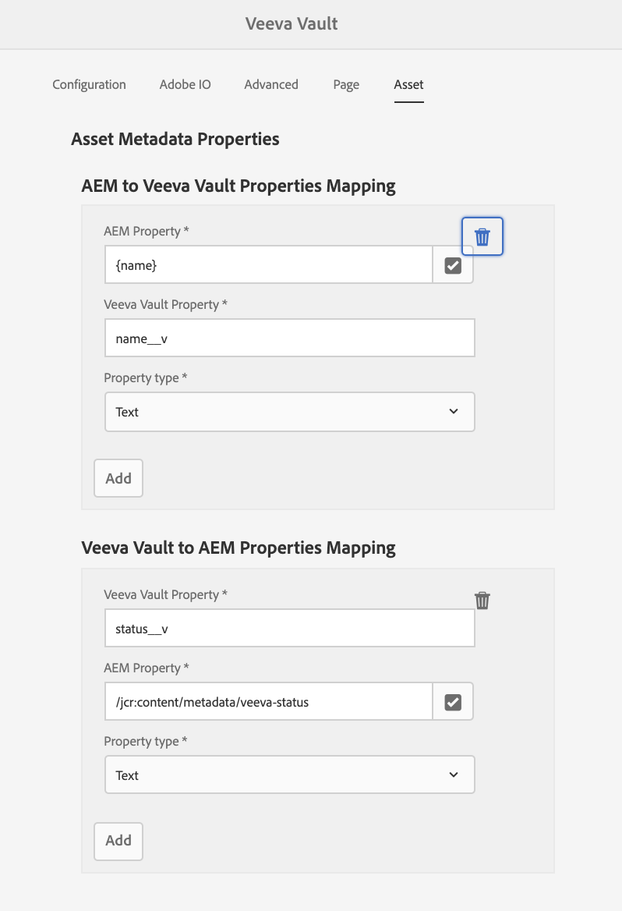
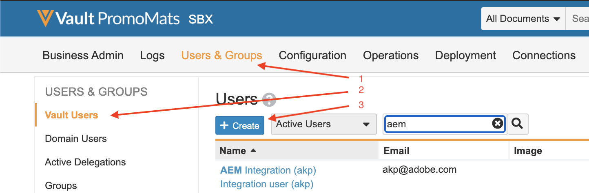
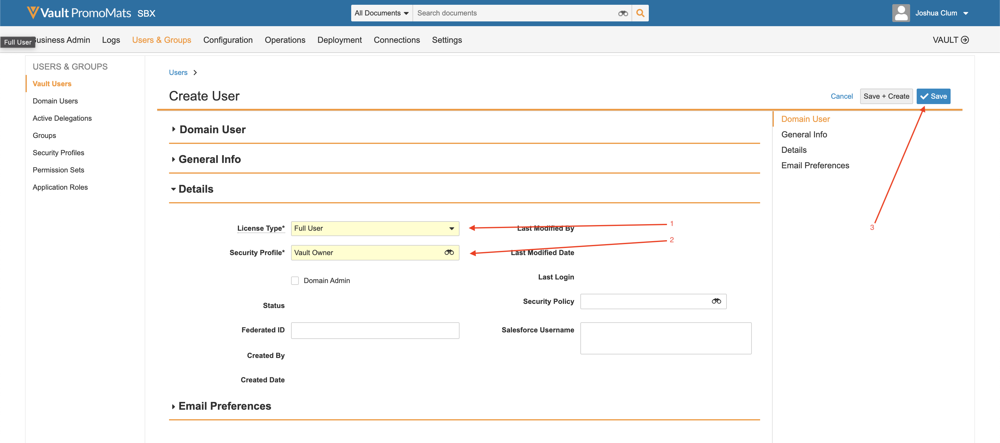

# 統合使用状況

## チュートリアル

次のビデオチュートリアルでは、コネクタの使用について説明します。

>[!VIDEO](https://video.tv.adobe.com/v/332137/?quality=12&learn=on)

## 設定

このガイドでは、コネクターの設定と実行について説明します。

>[!IMPORTANT]
>
>各システムに対して、これらの手順は、各システムに対して&#x200B;**管理者**&#x200B;が実行する必要があります。
>
>このドキュメントの手順では、権限の割り当てや管理者アクセスを含む統合/登録の作成について説明します。  これらのステップが実行する前に会社のポリシーに準拠していることを確認し、慎重に実行する責任があります。
>

### 統合パッケージをインストール

AEM統合パッケージへのアクセス権が付与されます。 統合をインストールするには、次の2つのオプションがあります。

1. **パッケージインストール** – 直進で関与が少ない。
2. **POM インストール** – より高度な機能ですが、AEM Cloud Managerを使用して統合をアップグレードする場合に便利です。

#### パッケージインストール

パッケージをインストールするには、オンボーディングメールに記載されているリンクをダウンロードします。 [AEM パッケージのインストール方法の詳細については、ここをクリックしてください。](https://experienceleague.adobe.com/docs/experience-manager-64/administering/contentmanagement/package-manager.html?#installing-packages)

#### POM インストール

コネクタをPOMに含めるには、次の手順に従います。 ユーザー名とパスワードを、オンボーディングメールで受信したユーザー名に置き換えます。

1. プロジェクトの`.cloudmanager/maven/settings.xml` ファイルまたはコンピューターの`~/.m2/settings.xml`に次のファイルを追加します。 `YOUR_USERNAME`をユーザー名に、`YOUR_PASSWORD`をオンボーディングメールで提供されたパスワードに置き換えます。

   >[!IMPORTANT]
   >
   >Cloud Managerを使用する場合、安全なアプローチは、[&#x200B; パスワードで保護されたMaven リポジトリ &#x200B;](https://experienceleague.adobe.com/docs/experience-manager-cloud-service/onboarding/getting-access/create-application-project/setting-up-project.html?lang=en#password-protected-maven-repositories)に関するこちらの手順に従うことです。

   ```
   <settings>
       ...
       <servers>
           ...
           <server>
               <id>repo.ea.adobe.net</id>
               <username>YOUR_USERNAME</username>
               <password>YOUR_PASSWORD</password>
               <filePermissions>BucketOwnerFullControl</filePermissions>
               <configuration>
                 <wagonProvider>s3</wagonProvider>
               </configuration>
           </server>
           ...
       </servers>
       ...
   </settings>
   ```

2. プロジェクトの`pom.xml` ファイルに以下を追加します。

   ```
   <project>
       ...
       <build>
           ...
           <extensions>
               ...
               <extension>
                   <groupId>com.allogy.maven.wagon</groupId>
                   <artifactId>maven-s3-wagon</artifactId>
                   <version>1.2.0</version>
               </extension>
               ...
           </extensions>
           ...
       </build>
       ...
       <repositories>
           ...
           <repository>
               <id>repo.ea.adobe.net</id>
               <url>s3://repo.ea.adobe.net/release</url>
               <releases>
                   <enabled>true</enabled>
               </releases>
           </repository>
           ...
       </repositories>
       ...
   </project>
   ```

3. プロジェクトの`all/pom.xml` ファイルに以下を追加します。 `project.dependencies.dependency.version`を適切なバージョンに、`project.build.plugins.plugin.configuration.embeddeds.embedded.target`を正しいパスに置き換えます。

   ```
   <project>
       ...
       <build>
           ...
           <plugins>
               ...
               <plugin>
                   <groupId>org.apache.jackrabbit</groupId>
                   <artifactId>filevault-package-maven-plugin</artifactId>
                   ...
                   <configuration>
                       ...
                       <embeddeds>
                           ...
                           <embedded>
                               <groupId>com.adobe.acs.aemveeva</groupId>
                               <artifactId>aem-veeva-connector.all</artifactId>
                               <type>zip</type>
                               <target>/apps/APP_NAME-packages/application/install</target>
                           </embedded>
                           ...
                       </embeddeds>
                   </configuration>
               </plugin>
               ...
           </plugins>
           ...
       </build>
       ...
       <dependencies>
           ...
           <dependency>
               <groupId>com.adobe.acs.aemveeva</groupId>
               <artifactId>aem-veeva-connector.all</artifactId>
               <version>1.0.5</version>
               <type>zip</type>
           </dependency>            
           ...
       </dependencies>
       ...
   </project>
   ```

### クラウド設定

この統合は、コネクタが動作するフォルダーにクラウド設定を作成することによって設定されます。 クラウド設定を作成するには、次の手順に従います。

1. Veeva クラウド設定に移動します。

   

2. 適切なフォルダーに新しいVeeva クラウド設定を作成し、次の節で説明するように、を入力します。

   

#### 「設定」タブ

「設定」タブに次の項目を入力します。



1. 必須。 Veeva Vault コネクタ設定のタイトル。 これは任意の値にすることができます。 (e.g. `Veeva Vault Configuration`)
2. 必須。 Veeva インスタンスのドメイン URL （例：`https://my-instance.veevavault.com/`）
3. 必須。 Veeva Vault APIの呼び出しに必要なClientID。 これは任意の値であり、主にデバッグに使用されます。 (e.g. `adobe-aem-vvtechpartner`)
4. 必須。 Veeva Vault ユーザー名。 [Veeva ユーザー作成](#veeva-user-creation)を参照してください。
5. 必須。 Veeva Vault パスワード。 [Veeva ユーザー作成](#veeva-user-creation)を参照してください。

#### 「Adobe IO」タブ

プロジェクトでページのPDFまたは画像を生成する必要がある場合は、このタブが必要です。 「adobe io」タブに次の項目を入力します。



1. 必須。 オンボーディングメールで提供されたPDF画像を作成するためのAdobe IO エンドポイント。 (e.g. `https://my-namespace.adobeioruntime.net/api/v1/web/aem-veeva-serverless-0.0.2/trigger-action.json`)
2. 必須。 ページ画像生成のアクション名。 この値は`aem-veeva-integration/get-image-async`である必要があります。
3. 必須。 html画像生成のアクション名。 この値は`aem-veeva-integration/get-pdf-async-new`である必要があります。
4. 必須。 Adobe IO エンドポイントを使用して、オンボーディングメールで提供された生成の状態を取得します（例：`https://my-namespace.adobeioruntime.net/api/v1/web/aem-veeva-serverless-0.0.2/get-state-value`）。
5. 必須。 Adobe IOで使用するAEM ユーザー名。 [AEM ユーザー作成](#aem-user-creation)を参照してください。
6. 必須。 Adobe IOで使用するAEM パスワード。 [AEM ユーザー作成](#aem-user-creation)を参照してください。
7. オプション。 デフォルトのタイムアウトは、AIO サービスが応答を取得しようとするのを停止するまで、ページに応答を返すことです。 デフォルト値は `30000` です。
8. オプション。 遅延とは、スクリーンショットを撮影する前にすべての画像がレンダリングされるまでの遅延を200で応答したページの後のことです。 デフォルト値は `2000` です。
9. オプション。 Screenshot/PDFで生成されたURLは、設定された値から数秒以内に期限切れとなります。
10. オプション。 Adobe IOのスクリーンショット/PDF生成サービスは非同期です。 AEM サービスは、AIO ステータスエンドポイントを呼び出してスクリーンショット/PDFを取得します。 このプロパティは、各ステータス呼び出しの間の一時停止をミリ秒単位で決定します。 デフォルト値は `10000` です。
11. オプション。 スクリーンショット/PDFを取得するためのAdobe IOへのステータス呼び出しの最大再試行回数。 デフォルト値は `10` です。

#### 「詳細」タブ

「詳細」タブに次の項目を入力します。



1. PDF/画像生成に必要です。 PDF/画像の作成時に使用されるファイル名パターン。 `{name}`はテンプレート化できます。 (e.g. `{name}-screenshot`)
2. オプション。 デスクトップ以外のページのスクリーンショットが必要なデバイスタイプ。 有効なタイプは`Tab (iPad)`と`Mobile (iPhone X)`です。
3. オプション。 上記のレンディションを表すVeevaのレンディションタイプ値。 (e.g. `web_ready__c`)
4. PDF/画像生成に必要です。 作成するスクリーンショットタイプ。 `PDF`または`Image`のいずれか。
5. PDF/画像生成に必要です。 生成するPDF タイプ。 `Print CSS Based PDF`または`Pixel Perfect Screenshot PDF`のいずれか。
6. PDF/画像生成に必要です。 生成する画像タイプ。 `PNG`または`JPEG`のいずれか。
7. 必須。 Veeva Vault承認トリガーが完了したら、実行するワークフロー。
8. 必須。 「承認済み」を表すステータスプロパティ値。 (e.g. `Approved for Distribution`)
9. 必須。 Veeva Vault Rejectトリガーが実行された後に実行するワークフロー。
10. 必須。 却下/未承認を表すステータスプロパティ値。 (e.g. `Rejected`)
11. オプション。 Veeva Vaultのドキュメント IDのプロパティ名。 デフォルト値は `id` です。
12. オプション。 Veeva Vaultのステータスのプロパティ名。 デフォルト値は `status__v` です。
13. オプション。 文書変更日のプロパティ名。 デフォルト値は `version_modified_date__v` です。
14. オプション。 ドキュメントリソース URLのプロパティ名。 デフォルト値は`external_id__v`です。 このフィールドが既に使用されている場合は、Veevaで別のフィールドを作成し、ここにフィールド名を入力します。 このフィールドは、VeevaでAEM リソースパスを保持するために使用されます。 これは、自動メタデータ同期のために必要です。
15. オプション。 Veeva Vaultのメジャーバージョン番号のプロパティ名。 デフォルト値は `major_version_number__v` です。
16. オプション。 Veeva Vaultのマイナーバージョン番号のプロパティ名。 デフォルト値は `minor_version_number__v` です。
17. オプション。 Veeva Vault関係タイプ値。 ページに追加されたすべてのアセットは、この値に基づいて関連するアセットとして表されます。 デフォルト値は `supporting_document__c` です。

#### 「ページ」タブ

ページを同期する場合は、「ページ」タブに次の項目を入力します。



1. 必須。 AEMからVeevaにプロパティをマッピングします。
a. AEM プロパティ名。 AEMのプロパティから選択可能です。 （例：`jcr:title`） `{name}`をテンプレート化できます。
b. に正確に入力されたVeeva プロパティ名は、Veevaに存在します。 (e.g. `name__v`)\
   c. プロパティタイプ： `Text`または`Multiline Text`のいずれか。

2. 必須。 VeevaからAEMにプロパティをマッピングします。
a. に正確に入力されたVeeva プロパティ名は、Veevaに存在します。 (e.g. `name__v`)
b. AEM プロパティ名。 AEMのプロパティから選択可能です。 (e.g. `jcr:title`)
c. プロパティタイプ： `Text`または`Multiline Text`のいずれか。


#### 「アセット」タブ

アセットを同期する場合は、「アセット」タブに次の情報を入力します。



1. 必須。 AEMからVeevaにプロパティをマッピングします。
a. AEM プロパティ名。 AEMのプロパティから選択可能です。 （例：`/jcr:content/metadata/jcr:title`） `{name}`をテンプレート化できます。
b. に正確に入力されたVeeva プロパティ名は、Veevaに存在します。 (e.g. `name__v`)
c. プロパティタイプ： `Text`または`Multiline Text`のいずれか。

2. 必須。 VeevaからAEMにプロパティをマッピングします。
a. に正確に入力されたVeeva プロパティ名は、Veevaに存在します。 (e.g. `name__v`)
b. AEM プロパティ名。 AEMのプロパティから選択可能です。 (e.g. `/jcr:content/metadata/jcr:title`)
c. プロパティタイプ： `Text`または`Multiline Text`のいずれか。

### 追加設定

#### AEM ユーザー作成

PDF/画像の生成中に、AEMからページを取得するには、AEM ユーザーを作成する必要があります。 次のリンクに従って、ユーザーに対する読み取り専用のアクセス許可を作成および付与します。

AEM 6.5.5以降を使用している場合：

* [AEMでのユーザーの作成](https://experienceleague.adobe.com/docs/experience-manager-65/forms/administrator-help/setup-organize-users/adding-configuring-users.html?#create-a-user)
* [AEMでのユーザーへの権限の追加](https://experienceleague.adobe.com/docs/experience-manager-65/administering/security/security.html?#permissions-in-aem)

AEM Cloud Servicesを使用している場合：

* [AEM Cloud Servicesによるユーザーの管理](https://experienceleague.adobe.com/docs/experience-manager-learn/cloud-service/accessing/aem-users-groups-and-permissions.html?#accessing)

PDF/Imageに変換され、Veevaにプッシュされるコンテンツに対するAEM サービスユーザーには、次の権限が必要です。

* 読み取り

>[!IMPORTANT]
>
> これらのアクションは、各システムの管理者として実行する必要があります。
> ユーザーを作成して権限を設定する場合は、組織のセキュリティ基準を遵守する必要があります。

#### Veeva ユーザー作成

この統合を使用するには、Veeva Vaultでユーザーを作成する必要があります。 ユーザーを作成するには、次の手順に従います。

1. 管理者/ユーザーとグループ/Vault ユーザー/作成に移動します

   

1. 必要な情報を入力します。 最も簡単な設定は、`License Type`を`Full User`に、`Security Profile`を`Vault Owner`に設定することです。 完了したら保存します。

   

使用されている特定のVeeva ドキュメントタイプには、次の権限が必要です。

* ドキュメントの作成/読み取り
* バージョンの作成/読み取り
* メタデータの作成/更新
* レンディションの作成/更新

>[!IMPORTANT]
>
> これらのアクションは、各システムの管理者として実行する必要があります。
> ユーザーを作成して権限を設定する場合は、組織のセキュリティ基準を遵守する必要があります。
